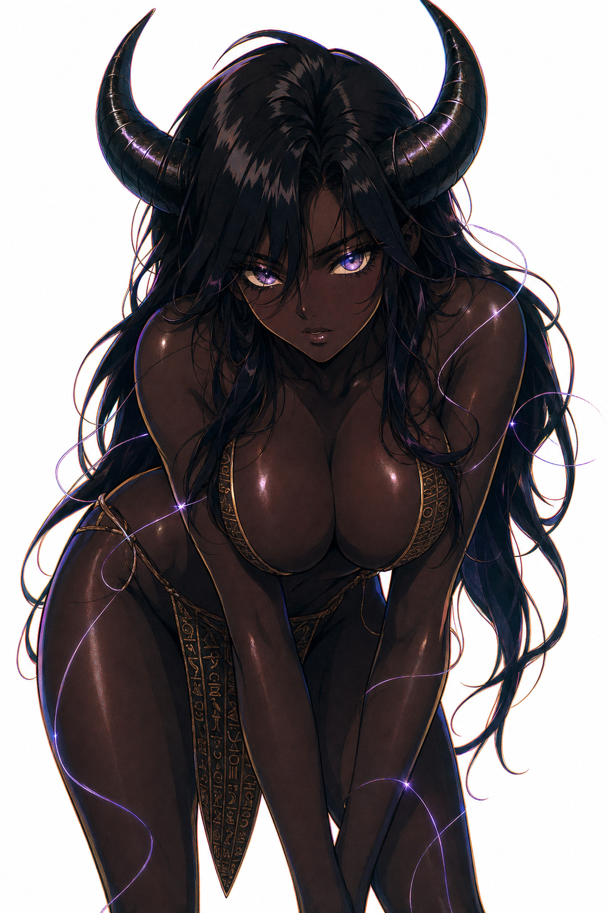
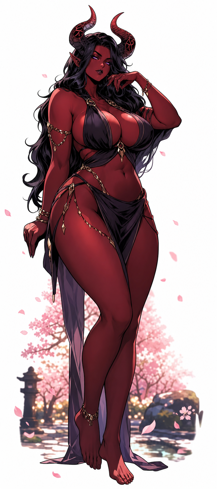
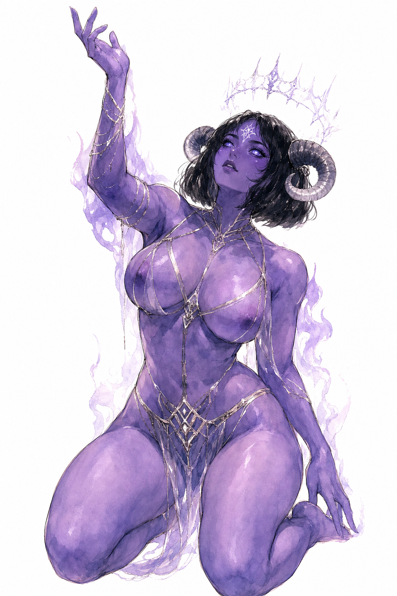

# FutaGen

I built this useless thing because I can.

  
  
  

---

## What it does

Generates demon lady characters. That's it.

You configure a seed, pick some settings, hit generate, and an AI draws a demon lady for you. The seed is 64 characters of base36 nonsense that encodes every trait — body, face, hair, horns, skin, outfit, mood, pose, eyes, and whatever specials you throw in. Change one character in the seed, get a different character. It's deterministic. It's reproducible. It's completely unnecessary.

---

## Features

- **Seed-based character DNA** — a 64-char base36 string encodes every trait. share a seed, get the same character every time
- **8 art styles** — Glistening Anime, Suzume Anime, Retro 90s, Classic Manga, Comic Ink, Concept Sketch, Watercolor, Cinematic Photo. they actually look different from each other now
- **Prompt-only mode** — generates just the AI prompt without burning image credits. useful for previewing or copy-pasting into other tools
- **Randomize** — dice button scrambles the seed instantly
- **Library** — every generated image gets saved. scroll through your collection of demon ladies
- **Backgrounds** — pure white or AI-selected atmospheric backdrop
- **Frame ratios** — portrait, landscape, square, standard, vertical
- **Compositions** — full body, head to knees, head to hips, extreme closeup
- **Bring your own API key** — stored locally in your browser, never touches the server

---

## Stack

Next.js · Tailwind · Supabase · GPT-4o · gpt-image-2

---

---

## Fork it. Break it. Make it yours

This is a seed-based character generator. The seed system, the trait tables, the prompt pipeline — all of it is wired up and working. You could point it at a completely different character concept and have something running in an afternoon.

Some directions you could actually go:

- swap the trait tables in Supabase for a different archetype (mech pilots, eldritch gods, whatever)
- replace gpt-image-2 with a local diffusion model or a different API
- build a PvP mode where two seeds fight and users vote on the winner
- make it multiplayer and collaborative — shared seeds, shared library
- strip the image generation entirely and use it as a pure prompt builder

The codebase is intentionally small. There's no auth, no payments, no analytics, no dark patterns. Fork it, rip out what you don't need, and build the thing you actually wanted.

PRs welcome if you fix something broken or add something genuinely useful. No contribution guidelines, no code of conduct, just don't be weird about it.

---

*For all the Melevola Lovers out there 💖.*
